<div id="header" align="left">
  
</div>
<div id="badges"align="left">

   <p align="center">
      <a href="">
         </a> 
      <a href="">
         </a> 
      <a href="">
         </a>
      <a href="">
         </a>
   </p>

<h1 align="center"><b> < Hi , I'm Yasser Fekry 👑 > </b></h1>

<h2 align = "center">▌│║▌║▌║ About Me ║▌║▌║│▌<picture></picture></h2>

```python
pragma python ^3.12.1
class AboutMe:
    def __init__(self):
        self.name = "Yasser Fekry 👑"
        self.roles = [
            "Bug Bounty Hunter 🕵️‍♂️",
            "Skilled Penetration Tester 🛠️",
            "Full Stack Developer 💻"
        ]
        self.experience = (
            "Extensive experience in identifying and exploiting security vulnerabilities 🔍 "
            "in both web 🌐 and mobile 📱 applications."
        )
        self.expertise = [
            "Testing systems for weaknesses 🧑‍💻",
            "Providing security recommendations 📝",
            "Ensuring applications are robust and secure 🔒"
        ]
if __name__ == "__main__":
    about_me = AboutMe()
    about_me.display_about_me()
```

<h2 align = "center"> Languages and Tools 🧰</h2>

<p align="center">
  <a href="https://skillicons.dev">
    
  </a>
</p>

<h2 align = "center"> Stats 📊</h2>

<table><tr><td valign="top" width="50%">

<br>



</td><td valign="top" width="50%">



</td></tr></table>

<table><tr><td valign="top" width="50%">


</td><td valign="top" width="50%">


</td></tr></table>

</details>

---


---


---

</div>

##

<p align="center" width="50">
 
</p>
